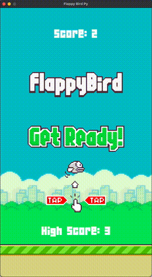

## Flappy Bird Py

Made according to [youtube](https://www.youtube.com/watch?v=UZg49z76cLw)

#### Instalation
In game folder:
```bash
pip3 install -r requirements.txt
```

#### Run game
```bash
python3 bird.py 
```
<div style="text-align:center">
  <h3>Game preview</h3>
  
</div>